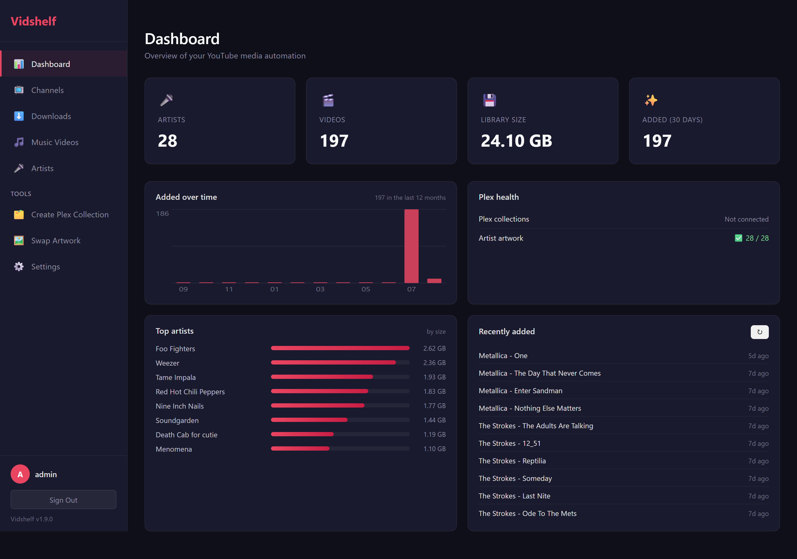
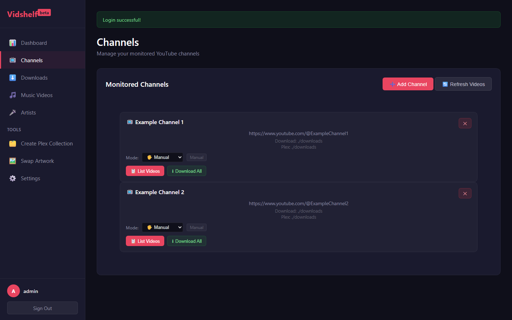
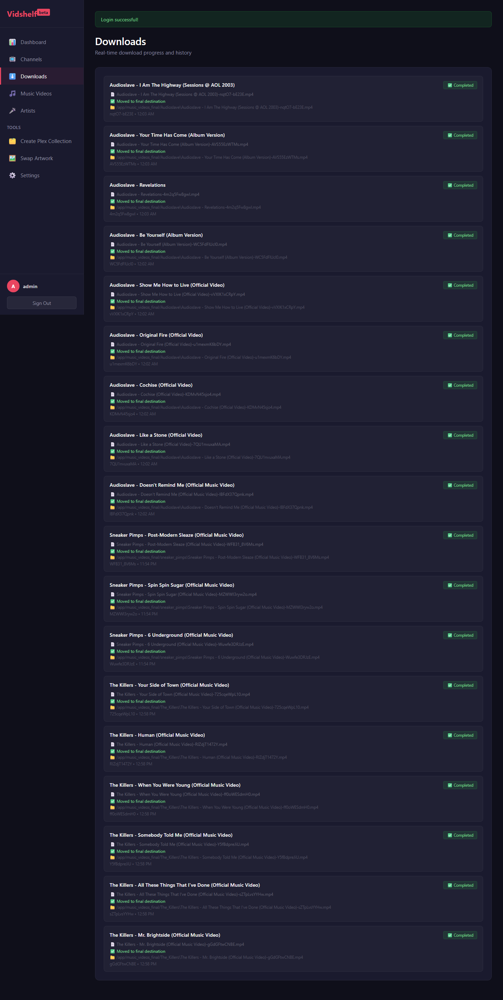
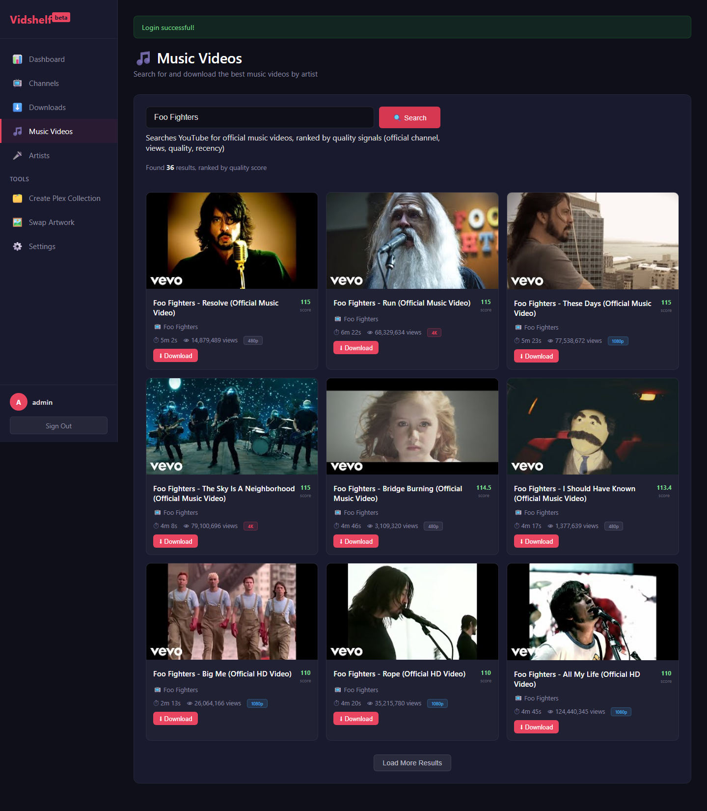
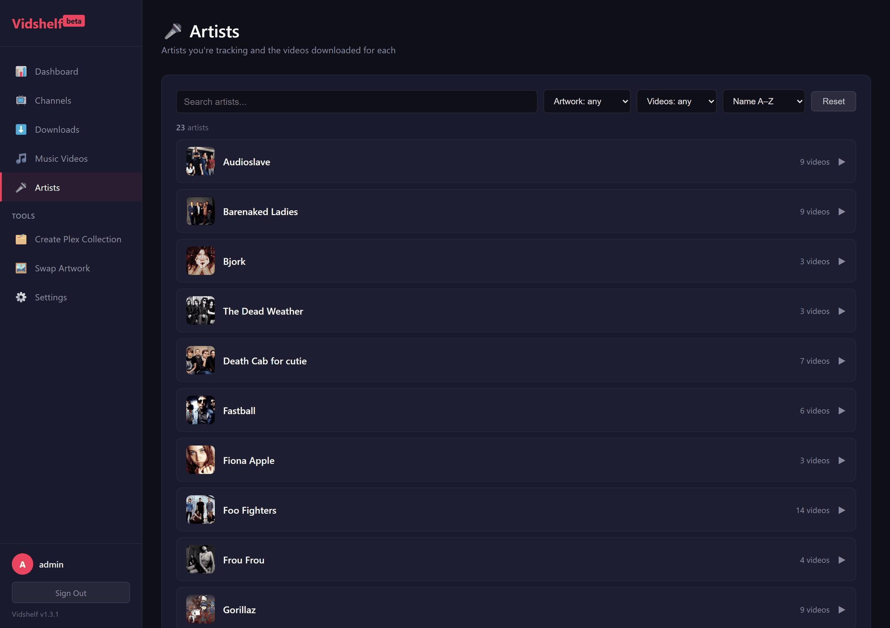
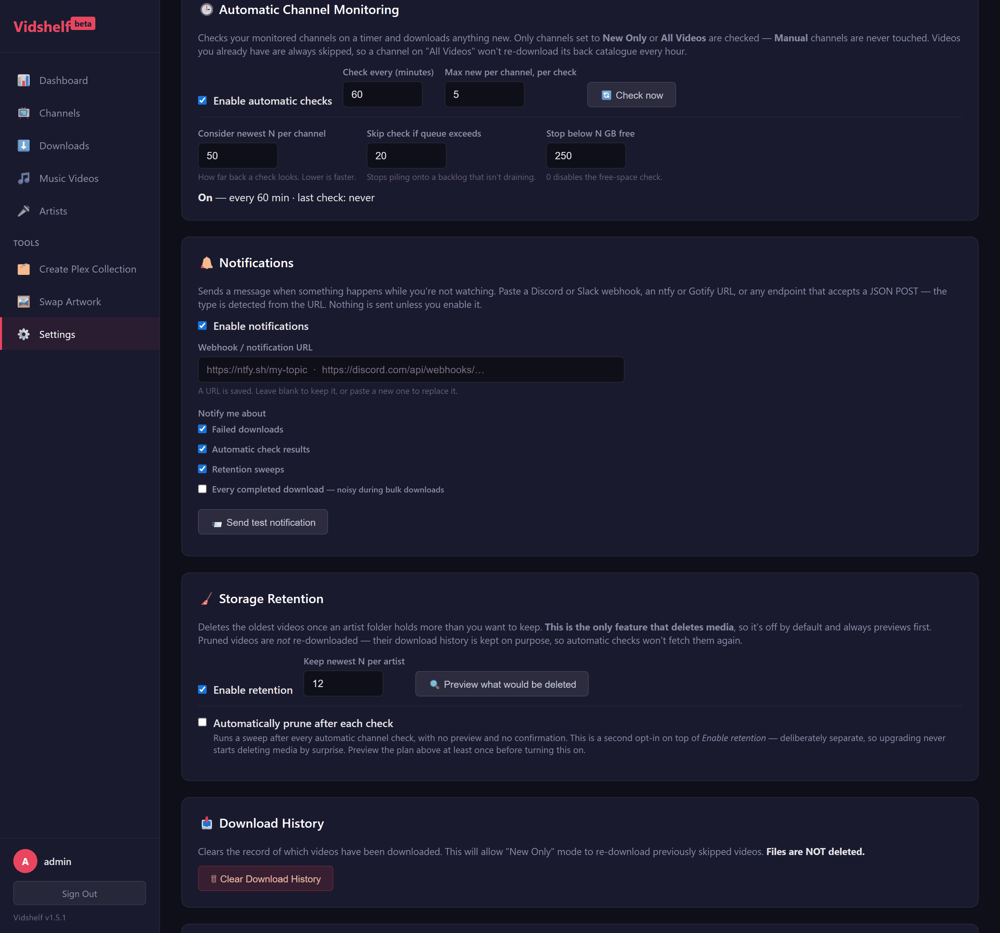
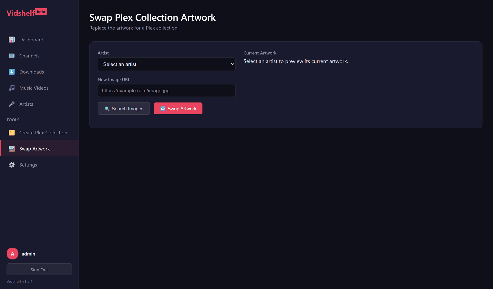
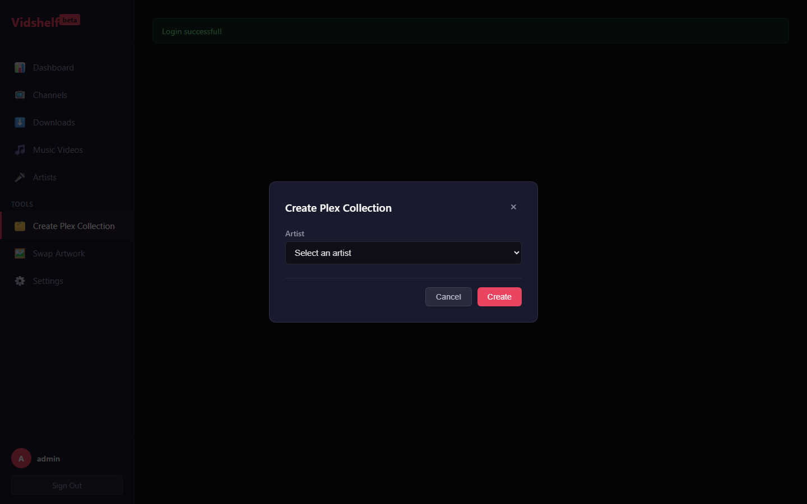

# Vidshelf

[](https://github.com/andysom25/Vidshelf/releases)
[](https://github.com/andysom25/Vidshelf/actions/workflows/ci.yml)
[](https://github.com/andysom25/Vidshelf/pkgs/container/vidshelf)
[](LICENSE)

A self-hosted YouTube channel downloader and music-video finder that organizes everything into a Plex-ready library — think Sonarr/Radarr for YouTube content, with deep Plex integration built in.

**Vidshelf** lets you monitor YouTube channels, browse and download their videos, and search for official music videos by artist. Downloads are automatically converted to a format virtually every Plex client can play without server-side transcoding, and — if you connect a Plex server — the app keeps artist artwork, smart collections, clean titles, and designed poster art in sync for you automatically.

> **Note:** actively developed, and still rough in places. It has tagged
> releases and multi-arch container images published on every release, so
> upgrades are predictable — but it's a personal project, not a product with
> support behind it.

---

## ⚠️ Before you use this

This tool downloads video content from YouTube. It's built for personal use — archiving your own uploads, channels you have permission to save, Creative Commons–licensed content, or anything else you have the legal right to download. Downloading copyrighted material without permission may violate YouTube's Terms of Service and applicable copyright law in your jurisdiction. You're responsible for how you use it.

This project is not affiliated with, endorsed by, or sponsored by YouTube, Google, or Plex Inc.

---

## Screenshots

| | |
|---|---|
| **Dashboard** | **Channels** |
|  |  |
| **Downloads** | **Music Video Finder** |
|  |  |
| **Artists** — searchable and filterable | **Settings** |
|  |  |
| **Swap Artwork** | |
|  | |

The Artists page mirrors what shows up in Plex: each tracked artist here becomes its own smart collection there, with the same artwork and video count. "Create Plex Collection" lets you back-fill a collection for an artist on demand:



---

## Features

### Automation
- **Automatic channel monitoring** — checks your channels on a timer and downloads anything new. Channels set to *Manual* are never touched, and videos you already have are always skipped, so "All Videos" won't re-fetch a back catalogue every hour
- **Notifications** — Discord, Slack, ntfy, Gotify or any JSON webhook, on failed downloads, check results and retention sweeps. Detected from the URL; off by default
- **Storage retention** — keeps the newest N videos per artist and prunes the rest, across every configured media root. Off by default, always previews first, refuses to run if a media volume looks unmounted, and can optionally sweep automatically after each check
- **Brakes on unattended growth** — stop downloading below a free-space floor, skip a check when the download queue is already backed up, and bound how far back each check looks. Channels that keep failing back off instead of retrying every time

### YouTube Channel Management
- **Add channels** by URL — automatically fetches the display name
- **Browse videos** — view the latest 50 videos from any channel
- **Download modes** — manual (pick videos), new (skip already-downloaded), all (download everything)
- **Bulk download** — download up to 20 videos in parallel with one click
- **Download history** — tracks downloaded video IDs per channel to avoid duplicates

### Music Video Finder
- **Search by artist** — enter an artist name (or artist + song to narrow results), get ranked music video results
- **Paginated results** — search results are cached server-side; click "Load More" to page through everything found instead of a fixed cutoff
- **Quality ranking** — results are scored on official-channel match, title quality keywords ("official", "music video", "HD", "4K", "lyric video"), view count, upload recency, and penalized for covers/karaoke/remixes/live versions/Shorts/trailers
- **Quality labels** — each result shows the best available resolution (4K, 1440p, 1080p, 720p)
- **Automatic artist matching** — searching "Artist + Song" to narrow results won't fork a duplicate artist folder/collection if that artist is already tracked
- **"Artist - Song" filenames** — music videos are named from the artist you searched for, not from whatever the uploader called the file. A video titled just "Closer" is saved as "Nine Inch Nails - Closer", which is what makes the Plex smart collection pick it up. Uses YouTube's own music metadata when it's available, and handles en-dashes and stylized quote characters
- **Cookies and the quality cap apply here too** — as of v1.8.0. Age-restricted music videos previously failed with no explanation, and the resolution cap was ignored

### Download Control
- **Cancel** a queued or running download, and **retry** anything that failed or was cancelled — from the Downloads page
- **Per-channel quality cap** — best available, 4K, 1440p, 1080p or 720p, set per channel so one 4K publisher doesn't force a global downgrade
- **Cookies support** — drop a yt-dlp `cookies.txt` into `data/` for age-restricted and members-only videos. Settings → System Health shows whether it was found

### Download Format & Quality
- Downloads the **best available quality** — 4K, 1080p60, 1440p, etc.
- **Automatic Plex-compatibility conversion** — prefers a native H.264/AAC stream at download time; if YouTube only offers something else (commonly VP9/AV1 + Opus for 4K or older uploads), converts to H.264/AAC/MP4 afterward so the widest range of Plex clients can direct-play it without server-side transcoding. Already-compatible tracks are stream-copied (no quality loss); only genuinely incompatible video gets re-encoded, at a high-quality setting chosen to be visually indistinguishable from the source.
- A batch conversion tool (Settings page) can fix an existing library that was downloaded before this feature existed.

### Plex Integration (optional, connect via OAuth)
- **Automatic artist artwork** — pulls artist images from TheAudioDB, Fanart.tv, MusicBrainz, and Wikipedia/Wikimedia Commons for any newly-detected artist folder
- **Automatic smart collections** — one Plex collection per artist, backed by a saved search filter so newly-downloaded videos are picked up automatically, no manual "update collection" step
- **Automatic title cleanup** — strips the trailing YouTube ID and "(Official Video)"-style boilerplate from Plex's displayed titles, and normalizes artist-name casing/separators (handles inconsistent capitalization, en/em-dashes, and stylized quote characters some artists use in their own uploads) so collection filters reliably match
- **Automatic title-card posters** — generates a designed poster (artist name + song title over the artist's own art) for each video, replacing Plex's randomly-extracted video-frame thumbnail
- **Manual artwork swap** — search and preview alternate artist images and swap a collection's poster/art on demand
- **Duplicate-collection cleanup** — detects and merges same-artist collections that can occur from race conditions, keeping one and removing the rest

### Dashboard
- **Library at a glance** — artists, videos, total size and how much you've added in the last 30 days
- **Added over time** — a 12-month chart of when videos arrived, drawn as inline SVG (no charting library, no build step)
- **Plex health** — how many artists have a collection and artwork, with a jump to the ones that don't
- **Top artists** and **Recently added** — where your space goes, and what landed most recently
- **Adaptive** — channel-monitoring cards only appear if you actually have channels, so a music-video-only install isn't shown a screen of zeroes
- Refreshes itself every 60s while open, without redrawing panels whose data hasn't changed
- Single-page web dashboard with a dark theme, responsive down to mobile
- Real-time download and conversion progress (polling-based, no WebSockets needed)
- Artists page — browse tracked artists and their downloaded videos, with search, filtering (missing artwork, empty folders) and sorting by name or video count
- Settings page — raw config view, path editors, Plex connection management, password change, video-format-compatibility scan/convert tools
- Version always visible in the sidebar, with an optional once-a-day check for new releases (notifies only — never downloads or installs anything, and can be switched off in Settings)

### Security
- No hardcoded credentials — a random admin password is generated on first run (or set your own via env vars) and printed once to the logs
- Session-signing key is randomly generated and persisted, not a fixed value baked into source
- Login throttling, security response headers, SSRF guarding on every endpoint that fetches a URL, hardened session cookies
- Runs with **no added Linux capabilities** (`cap_drop: ALL`), and `config.json` is written owner-only
- The Plex token is never sent to the browser — the interface only needs to know whether one is set
- **Every endpoint requires a login**, and the test suite enforces it: an endpoint must refuse an anonymous caller before it validates anything else, across both GET and POST

---

## Quick Start

### Option 1: Docker image (Recommended)

No clone or build required. Create a `docker-compose.yml`:

```yaml
name: vidshelf

services:
  vidshelf:
    image: ghcr.io/andysom25/vidshelf:latest
    container_name: vidshelf
    restart: unless-stopped
    ports:
      - "5000:5000"
    volumes:
      - ./data:/app/data           # config + download history (keep this)
      - ./downloads:/app/downloads # downloaded videos
    environment:
      - ADMIN_USERNAME=admin
      # Leave unset to have one generated and printed to the logs on first run
      - ADMIN_PASSWORD=
```

```bash
docker compose up -d

# Grab the generated admin password if you didn't set one
docker compose logs | grep SECURITY

# Open http://localhost:5000
```

Images are published for `linux/amd64` and `linux/arm64`, so this runs on a
Synology or Raspberry Pi as-is. Pin a version (`:1.1.0`, `:1.1`, `:1`) instead
of `latest` if you'd rather upgrade deliberately.

Mounting a NAS share for music videos, or want the full set of options? See
the repo's own [`docker-compose.yml`](docker-compose.yml) — it documents the
`cifs` volume setup and every environment variable.

### Option 2: Docker from source

```bash
git clone https://github.com/andysom25/Vidshelf.git
cd Vidshelf

# Optional: copy and edit the env template (admin credentials, NAS share
# for the music-video CIFS mount, Plex OAuth client identity, etc.)
cp .env.example .env

docker compose up -d --build
docker compose logs | grep SECURITY
```

### Option 3: Local (Python)

```bash
# Clone the repo
git clone https://github.com/andysom25/Vidshelf.git
cd Vidshelf

# Install Python dependencies
pip install -r requirements.txt

# Install ffmpeg (required for downloading and format conversion)
# Windows: winget install "FFmpeg (Essentials Build)"
# macOS:   brew install ffmpeg
# Linux:   sudo apt install ffmpeg

# Start the server
python app.py

# Check the console output for your generated admin password if you
# didn't set ADMIN_PASSWORD
# Open http://localhost:5000
```

---

## Upgrading

Normally there's nothing to do beyond pulling the new image:

```bash
docker compose pull && docker compose up -d      # published image
docker compose up -d --build                     # building from source
```

Your `data/` directory carries config and history across upgrades, so nothing
needs migrating.

### `update.ps1` (Windows)

A one-shot wrapper around the above that also checks the things worth checking:

```powershell
.\update.ps1                    # latest release
.\update.ps1 -Recreate          # full down/up, for compose changes
.\update.ps1 -Version 1.8.2     # pin, or roll back
```

Beyond running `pull` and `up`, it verifies the container reports the version it
just pulled (a locally-built image sharing the same tag will otherwise shadow the
release), waits until the app actually answers rather than assuming, confirms the
media mounts are real CIFS rather than Docker's silent decoy volume, and prints
what the startup housekeeping did.

### Coming from v1.0.0 (one-time)

v1.0.0 kept state as three individual bind-mounted JSON files. **v1.1.0 moved
all of it into a `data/` directory** — a change that was required, not
cosmetic: Docker bind-mounts a single file by inode, which makes crash-safe
atomic writes impossible, and a fresh clone (where those gitignored files
don't exist) got *directories* created in their place and crash-looped on
startup.

If you're upgrading from v1.0.0, move your state files **before** starting the
new version:

```bash
docker compose down

mkdir -p data
mv config.json downloaded_videos.json active_downloads.json data/ 2>/dev/null

# Replace the three file mounts in docker-compose.yml with:
#   - ./data:/app/data
docker compose up -d --build   # --build, or switch to the published image
```

Nothing is deleted if you skip this — your files stay where they are and
Vidshelf simply starts with empty config — but you'd have to reconnect Plex
and re-add your channels, so it's worth the 30 seconds. A local (non-Docker)
install migrates itself automatically on first start; only Docker needs the
manual move, because the container can't see host files that are no longer
mounted. Full detail in `state.py`.

---

## Configuration

### Environment variables

All optional — see `.env.example` for the full template.

| Variable | Purpose |
|----------|---------|
| `ADMIN_USERNAME` / `ADMIN_PASSWORD` | Set your own admin login. If unset, a random password is generated on first run and printed once to the logs. |
| `SECRET_KEY` | Flask session-signing key. Auto-generated and persisted into `config.json` if unset. |
| `SESSION_COOKIE_SECURE` | Set `true` only if served over HTTPS (e.g. behind a reverse proxy). |
| `PLEX_CLIENT_ID` / `PLEX_PRODUCT` | This deployment's identity for Plex's OAuth flow. Auto-generated/persisted if unset. |
| `NAS_SMB_USER` / `NAS_SMB_PASS` / `NAS_SMB_DEVICE` | Only needed if you use the Docker Compose `cifs` volume for a network share — see the comments in `docker-compose.yml`. |
| `FFMPEG_PATH` | Override the ffmpeg/ffprobe binary location if not on `PATH`. |
| `MAX_CONCURRENT_DOWNLOADS` | Max downloads (and their format-conversion re-encodes) running at once, across all download types combined. Defaults to `2` — format conversion is CPU/memory-heavy, so raise this only if your hardware can handle more concurrent encodes. |
| `VIDSHELF_DATA_DIR` | Where persistent state (`config.json`, download trackers) is kept. Defaults to `./data`. In Docker leave this alone and mount a volume at `/app/data` instead. |
| `PORT` | Port to listen on. Defaults to `5000`. In Docker, remap on the host side instead (`-p 8080:5000`). |
| `SERVER_THREADS` | waitress request threads. Defaults to `8`. Raise it if the UI feels unresponsive while a slow directory scan is running. |
| `FLASK_DEBUG` | `true` swaps waitress for Werkzeug's development server with the interactive debugger. **Local development only** — that debugger executes arbitrary code. |

### `config.json`

Everything else lives in `data/config.json` (created automatically,
gitignored — copy `config.json.example` into `data/` if starting from
scratch), and is fully editable from the Settings page. Set
`VIDSHELF_DATA_DIR` to keep state somewhere other than `./data`:

```json
{
  "channels": [
    {
      "url": "https://www.youtube.com/@ChannelName",
      "download_path": "./downloads",
      "plex_media_path": "./downloads",
      "download_mode": "new"
    }
  ],
  "plex_base_path": "./downloads",
  "artwork_sync": {
    "root_path": "/app/music_videos_final",
    "watch_interval": 120,
    "plex_collection_sync_on_artwork": true,
    "fanarttv_api_key": ""
  },
  "plex": {
    "server_url": "",
    "token": "",
    "music_video_library_key": ""
  }
}
```

`artwork_sync.root_path` is where music videos are downloaded to **and** the
folder watched for artist artwork and Plex collections. It's the same value as
Settings → "Music Video Plex Path".

> **Upgrading from v1.7.0 or earlier:** there used to be a second key,
> `music_video_plex_path`, which the Settings page wrote and nothing read — the
> download destination was hardcoded. v1.8.0 removes it automatically on first
> start. If your two values disagreed, Settings shows both and asks you to pick;
> nothing is moved or adopted for you.

### Automation settings

All configured from **Settings** (they need to change at runtime), stored in
`data/config.json` under `channel_monitor`, `notifications` and `retention`.
Everything here is **off by default**.

| Setting | Default | What it does |
|---------|---------|--------------|
| Check every (minutes) | `60` | How often channels are checked. Floored at 5 |
| Max new per channel, per check | `5` | So a newly-added channel trickles in rather than flooding the queue |
| Consider newest N per channel | `50` | How far back a check looks. Lower is faster |
| Skip check if queue exceeds | `20` | Skips a check entirely when downloads are already backed up |
| Stop below N GB free | `0` (off) | Stops queuing downloads when the destination is nearly full |
| Keep newest N per artist | `10` | Retention target, per artist folder, per media root |
| Automatically prune after each check | off | Second opt-in on top of *Enable retention* |

Set per channel on the **Channels** page rather than here:

| Setting | Default | What it does |
|---------|---------|--------------|
| Max | Best available | Caps the resolution downloaded from that channel. Applies to every fallback, so a 1080p cap can't be overridden by a channel that only publishes 4K AV1 |

Two behaviours that surprise people if they don't know them:

- **Videos you already have are never re-downloaded by a check**, even on *All
  Videos*. That mode only means "ignore history" when *you* trigger it manually.
- **Pruned videos don't come back.** Retention deletes files but keeps the
  download history deliberately — otherwise checks would re-fetch exactly what
  was just pruned, forever. Clearing download history makes them eligible again.

### Download Modes

| Mode | Behavior |
|------|----------|
| `manual` | User clicks individual Download buttons |
| `new` | "Download All" skips already-downloaded videos |
| `all` | "Download All" downloads up to 20 videos regardless of history |

---

## Usage

### Managing Channels
1. **Add a channel** — Click "Add Channel" in the Channels page, paste the YouTube channel URL
2. **Browse videos** — Click on a channel card to load its latest 50 videos
3. **Download a video** — Click the download icon on any video
4. **Bulk download** — Use "Download All" to download all or only new videos

### Finding Music Videos
1. Navigate to **Music Videos** in the sidebar
2. Enter an artist name (e.g., "Foo Fighters") and click Search
3. Browse the ranked results — highest quality official videos appear first; click "Load More" for additional results
4. Click **Download** on any result to save it to the music video Plex path

### Connecting Plex (optional)
1. Go to **Settings** → Plex Integration → **Connect to Plex**
2. Authorize in the Plex tab that opens, then select your server and confirm the discovered music-video library
3. From then on, artwork, collections, title cleanup, and title-card posters stay in sync automatically as you download — the Settings page also has manual "Sync Collections", "Clean Up Titles", "Generate Title Cards", and "Remove Duplicate Collections" actions if you want to trigger something immediately

### Automatic downloads, notifications and cleanup
1. Set a channel's mode to **New Only** (or **All Videos**) on the Channels page
2. Go to **Settings** → **Automatic Channel Monitoring**, tick *Enable*, and pick an interval
3. Optionally set up **Notifications** so you hear about failures without reading logs — paste an ntfy/Discord/Slack/Gotify URL and hit *Send test notification*
4. If downloads will run unattended for a long time, set up **Storage Retention** — choose how many videos to keep per artist, hit *Preview*, and only then delete. Once you've seen a preview you trust, **Automatically prune after each check** keeps it bounded without you
5. Worth setting if you're leaving it alone for weeks: **Stop below N GB free**, so checks stop downloading before the volume fills

Three things worth knowing:

- Videos you already have are **always** skipped by automatic checks, so a channel on *All Videos* won't re-download its back catalogue on every pass.
- **Pruned videos are not re-downloaded.** Retention deletes files but keeps the download history on purpose — otherwise monitoring would re-fetch what retention just removed, forever. Clearing download history is what makes them eligible again.
- Retention **refuses to run** if your media root contains no artist folders, on the assumption that the volume isn't mounted. Check `docker exec vidshelf df -h` if you see that.

### Fixing an existing library's video format
1. Go to **Settings** → Video Format Compatibility → **Scan Library** to see what's not yet Plex-direct-play-compatible
2. Click **Convert All Non-Compatible Videos** to fix it — this can take a while for a large library (re-encoding is CPU-intensive), so it runs in the background with a progress indicator

---

## API Endpoints

<details>
<summary>Channel &amp; download management</summary>

| Endpoint | Method | Description |
|----------|--------|-------------|
| `/api/channels` | GET | List all channels |
| `/api/channel/videos` | GET | `?url=` — List latest 50 videos |
| `/api/channels/add` | POST | Add a channel |
| `/api/channels/remove` | POST | Remove a channel |
| `/api/channels/mode` | POST | Update download mode (manual/new/all) |
| `/api/channels/download-all` | POST | Bulk download all/new videos |
| `/api/download` | POST | `{video_id, channel_url}` — Start a channel-video download |
| `/api/downloads/progress` | GET | Real-time download/conversion status |
| `/api/downloads/verify` | POST | Verify downloaded files exist at their final destination |
| `/api/downloads/clear` | POST | Clear download history |
| `/api/downloads/<id>/cancel` | POST | Cancel a queued or running download |
| `/api/downloads/<id>/retry` | POST | Re-queue a failed or cancelled download |
| `/api/channels/quality` | POST | `{url, max_height}` — cap a channel's resolution (0 clears) |

</details>

<details>
<summary>Music videos</summary>

| Endpoint | Method | Description |
|----------|--------|-------------|
| `/api/music-videos/search` | POST | `{artist, page}` — Paginated, ranked music video search |
| `/api/music-videos/download` | POST | `{video_id, title, artist}` — Download a music video |
| `/api/music-video-path` | GET/POST | Get/set the music video Plex path |
| `/api/artists` / `/api/artists/summary` / `/api/artists/videos` | GET | List tracked artists and their downloaded videos |

</details>

<details>
<summary>Plex integration</summary>

| Endpoint | Method | Description |
|----------|--------|-------------|
| `/api/plex/oauth/start` / `/check` / `/servers` | POST | Plex OAuth login flow |
| `/api/plex/config` | GET/POST | Get/set Plex server URL, token, library key |
| `/api/plex/discover-library` | POST | Auto-discover the music-video library |
| `/api/plex/collections/sync` / `/status` | POST/GET | Sync or check Plex smart collections |
| `/api/plex/collections/duplicates` / `/dedupe` | GET/POST | Find/remove duplicate collections |
| `/api/plex/titles/clean` | POST | Clean up video titles in the library |
| `/api/plex/title-cards/generate` | POST | Generate designed poster art per video |
| `/api/artwork/sync` / `/status` | POST/GET | Sync/check artist artwork |
| `/api/artwork/search` / `/swap` | GET/POST | Search and swap artist artwork. The former `_noauth` paths remain as aliases and now also require a session (v1.7.0); prefer these names |

</details>

<details>
<summary>Format conversion</summary>

| Endpoint | Method | Description |
|----------|--------|-------------|
| `/api/conversion/scan` | POST | Report which existing files need conversion |
| `/api/conversion/start` | POST | Start the batch conversion job |
| `/api/conversion/status` | GET | Poll conversion job progress |

</details>

<details>
<summary>System &amp; settings</summary>

| Endpoint | Method | Description |
|----------|--------|-------------|
| `/api/stats` / `/api/system/info` | GET | Dashboard statistics and system info |
| `/api/system/health` | GET | Dependency check (ffmpeg, ffprobe, Pillow, fonts) |
| `/api/system/version` | GET | Running version, and whether a newer release exists |
| `/api/system/update-check` | POST | `{enabled}` — turn the release check on or off |
| `/api/monitor/status` | GET | Monitoring state, last run, per-channel results |
| `/api/monitor/config` | POST | `{enabled, interval_minutes, max_per_channel}` |
| `/api/monitor/run` | POST | Run one check immediately |
| `/api/notifications/config` | POST | `{enabled, url, kind, events}` — the URL is never echoed back |
| `/api/notifications/test` | POST | Send a test notification |
| `/api/retention/config` | POST | `{enabled, keep_last_per_artist}` |
| `/api/retention/plan` | GET | Dry run — what a sweep would delete. Deletes nothing |
| `/api/retention/apply` | POST | `{"confirm": "DELETE"}` — actually deletes |
| `/api/config` | GET/POST | Raw config access (internal keys stripped) |
| `/api/password` | POST | Change admin password |
| `/api/plex-base-path` | GET/POST | Get/set Plex base path |
| `/api/browse-folder` | POST | Browse filesystem directories |

</details>

---

## Docker

### Volume Layout

| Host Path | Container Path | Purpose |
|-----------|---------------|---------|
| `./data/` | `/app/data` | All persistent state — `config.json`, download history, runtime progress |
| `./downloads/` | `/app/downloads` | Persistent downloads (survives rebuilds) |
| `music_videos_final` (named volume) | `/app/music_videos_final` | Music-video library — a native `cifs` mount if you're pointing at a network share (see `docker-compose.yml`); swap for a plain bind mount if you're storing locally instead |

> **Mount the `data` *directory*, never the individual JSON files inside it.**
> Docker bind-mounts a single file by inode, and Vidshelf writes state
> atomically (temp file + rename), which replaces the inode — so per-file
> mounts silently stop propagating writes to the host. `state.py` explains it
> in full.

### Simple local-storage setup

The `docker-compose.yml` in this repo is set up for a network share (a
native `cifs` volume, since Docker Desktop can't reliably bind-mount a
Windows drive letter or UNC path — see `REFERENCE.md` for why). If you
just want to store your music-video library on local disk instead of a
NAS, replace the `music_videos_final` volume with a plain bind mount:

```yaml
services:
  vidshelf:
    build: .
    container_name: vidshelf
    restart: unless-stopped
    ports:
      - "5000:5000"
    volumes:
      - ./data:/app/data
      - ./downloads:/app/downloads
      - ./music_videos:/app/music_videos_final   # local folder instead of a NAS share
    environment:
      - ADMIN_USERNAME=${ADMIN_USERNAME:-}
      - ADMIN_PASSWORD=${ADMIN_PASSWORD:-}
```

No `cap_add`/`driver_opts`/`NAS_SMB_*` variables needed for this version —
those only matter for the `cifs` network-share setup. See `.env.example`
for every environment variable this app recognizes.

### Health check

The image declares a `HEALTHCHECK`, so `docker ps` reports `healthy` /
`unhealthy` rather than only `up`. That matters with `restart: unless-stopped`,
which otherwise can't distinguish a wedged app from a working one:

```bash
docker inspect --format '{{.State.Health.Status}}' vidshelf
```

### Commands

```bash
# Build and start
docker compose up -d

# View logs
docker compose logs -f

# Rebuild after code changes
docker compose up -d --build

# Stop
docker compose down
```

---

## Dependencies

- **Python 3.12** (see `Dockerfile`) — Flask, waitress, yt-dlp, requests, Pillow
- **ffmpeg** — required for merging downloaded streams and for format conversion (installed automatically in Docker)

Versions in `requirements.txt` are pinned exactly, so a build today produces
the same image as a build last month. yt-dlp is the exception that still needs
to move — YouTube changes break extraction regularly — so a scheduled workflow
proposes a new pin weekly as a pull request with the test suite already run
against it.

---

## Architecture

```
User Browser ──► Flask Server (app.py) ──► yt-dlp ──► YouTube
                     │                           │
                     │  downloader.py            │
                     │  (download queue,         │
                     │   progress tracking)       │
                     │        │                   │
                     │        ▼                   │
                     │  transcode.py              │
                     │  (Plex-compatibility        │
                     │   format conversion)        │
                     │        │                   │
                     ▼        ▼                   │
              Plex Media Directory                │
                     │                            │
                     ▼                            │
              artwork_sync.py ◄────────────────────┘
              (Plex OAuth, artist artwork,
               smart collections, title
               cleanup, title-card posters)
                     │
                     ▼
              Plex Media Server

data/config.json, data/downloaded_videos.json, data/active_downloads.json
  — file-based JSON storage via state.py, no database required
```

| Module | Responsibility |
|--------|----------------|
| `app.py` | Flask routes, session auth, download orchestration |
| `downloader.py` | yt-dlp download queue and progress tracking |
| `transcode.py` | Plex-direct-play format conversion |
| `artwork_sync.py` | Plex OAuth, artist artwork, collections, title cards |
| `artwork_swap.py` | Manual artist-artwork replacement |
| `state.py` | Crash-safe, lock-protected JSON persistence |
| `updates.py` | Cached GitHub release check |
| `static/`, `templates/` | Dashboard CSS/JS and Jinja templates |
| `tests/` | Dependency-free test suites (Python + node) |

- **File-based JSON storage** — no database required. Writes are atomic
  (temp file + rename) and lock-protected, so an interrupted write can't
  truncate your config and concurrent downloads can't clobber each other's
  history.
- **Threaded downloads** — a bounded worker pool, no Redis/Celery needed
- **Progress polling** — no WebSockets
- **Client-side filtering** on the Artists page, so searching doesn't re-scan
  the media directory on every keystroke

---

## Troubleshooting

### The page hangs for ~30 seconds and assets show as "(failed)" (Windows)

If the dashboard sits on "Loading…", browser DevTools shows scripts `(failed)`
after about 30 seconds, and `docker logs vidshelf` is clean — this is almost
certainly **WSL**, not Vidshelf.

WSL's `wslrelay.exe` claims the IPv6 loopback address for whatever port Docker
publishes, and Windows resolves `localhost` to IPv6 before IPv4. Your browser
reaches WSL instead of Vidshelf; it accepts the connection and never answers,
which is why you get a hang rather than a connection error.

Confirm it in ten seconds:

```bash
curl http://127.0.0.1:5000/login    # works
curl http://localhost:5000/login    # hangs
netstat -ano | findstr :5000        # two different PIDs listening
```

If IPv4 works and `localhost` doesn't, add this to `%UserProfile%\.wslconfig`
and run `wsl --shutdown`:

```ini
[wsl2]
localhostForwarding=false
```

Docker publishes on all interfaces independently, so your containers stay
reachable. The trade-off is that services running *inside* a WSL distro are no
longer reachable from Windows via `localhost` — use the distro's IP for those.

**Changing Vidshelf's port does not help** — WSL rebinds whatever port Docker
publishes, and will follow it.

### Music Video search says "Failed to fetch" or times out

Fixed in **v1.10.1** — upgrade first. Before that release, the search asked
YouTube for a quality label on each of 9 results one at a time with no network
timeout, so a single slow response held the whole request open until the browser
gave up. `Failed to fetch` is the browser's wording for a dead connection, not an
error from Vidshelf.

On v1.10.1+ the lookups are bounded and run concurrently, and the message tells
you which layer failed. If you still see a timeout:

- **YouTube is throttling you.** Wait a minute and retry. Results are cached per
  artist, so a retry that succeeds is fast.
- **You reach Vidshelf through a reverse proxy.** Raise its read timeout — nginx
  and Nginx Proxy Manager default to 60s, and a cold search on a slow connection
  can approach that. The search itself gives up at 45s.

### A feature disappears after working (watchtower)

If you run [watchtower](https://containrrr.dev/watchtower/) and build Vidshelf
locally, tag your build something other than `ghcr.io/andysom25/vidshelf:latest`.
Watchtower watches that tag and will replace your local image with the published
release on its next scan, stopping and recreating the container — so a locally
built feature silently reverts. A tag that doesn't exist in the registry can't
be pulled over it.

---

## Known Limitations

- Served by [waitress](https://github.com/Pylons/waitress), which is fine for
  a single-admin app on a trusted network — but it terminates plain HTTP with no
  TLS, so put it behind a reverse proxy if you expose it beyond your LAN
- Music Video search relies on YouTube search (no dedicated data API)
- Plex collections match on an "Artist - Song" title. Music videos are named that way at download time (v1.8.0+), so this mostly affects **channel** downloads, which keep the uploader's own title — and files downloaded before v1.8.0, for which the Settings → "Clean Up Titles" tool is the fix
- This is a personal project — it has tagged releases, CI and published
  images, but no support commitment behind it

---

## Development

```bash
# Tests — no pytest or npm install required
python tests/test_state.py         # atomic writes, locking, migration
python tests/test_updates.py       # version comparison, update-check caching
python tests/test_routes.py        # every route: registered, no 500s, auth enforced
python tests/test_scheduler.py     # monitoring logic + retention safety guards
python tests/test_notify.py        # notification targets, payloads, gating
python tests/test_media.py         # transcode decisions, SSRF guard, title/folder helpers
python tests/test_downloads.py     # format selector, cancellation
python tests/test_titles.py        # download-time "Artist - Song" naming
python tests/test_download_state.py# interrupted downloads, history pruning, copystat
python tests/test_library.py       # library scan, caching, chart series
python tests/test_invariants.py    # source-level rules for bugs CI can't reproduce
node tests/test_artists_filter.js   # Artists page search/filter/sort logic

# Optional, and skipped (exit 0) unless a live instance is configured and
# Playwright is installed. Catches the bugs only a rendered page shows.
pip install playwright && playwright install chromium
VIDSHELF_URL=http://127.0.0.1:5000 VIDSHELF_PASSWORD=... python tests/test_browser.py
```

`test_invariants.py` is unusual: it asserts on the *source text*. Some bugs in
this project only manifest against a real CIFS mount or a real container restart
— `shutil.copy` onto a network share, state files bind-mounted individually,
missing `PYTHONUNBUFFERED` — so no functional test can reach them. Those checks
fail loudly in CI instead of relying on someone reading a comment at the moment
they change the line.

They're plain assertions on purpose, so they run identically here and in CI
with no dev dependencies to install.

**Branching** — `dev` is where work happens; `main` is releases only.

**Releasing** — bump `VERSION` on `dev` and merge to `main`. CI does the rest:
it tags the release, builds and pushes multi-arch images to
`ghcr.io/andysom25/vidshelf`, and creates the GitHub release. A merge that
doesn't change `VERSION` releases nothing.

**Before merging a release** — run the pre-release drill (Windows, Docker
Desktop):

```powershell
.\prerelease.ps1
```

It runs the unit suite, builds the image, starts a **throwaway** container on a
spare port (your real one keeps running), then checks the things CI structurally
cannot: that the media mount is a real network share rather than a decoy volume,
that `utime`/`chmod` on a file the container doesn't own actually succeed, that
a library scan returns real numbers, that anonymous callers are rejected, and
that the browser smoke test passes against the rendered page. Finally it
upgrades from the previous release's image on the same data directory. It ends
by printing what it did **not** cover — a real download and a real Plex sync
are still manual, and CI is not a substitute for either.

---

## License

MIT — see [LICENSE](LICENSE).

---

## Acknowledgements

Built with:
- [yt-dlp](https://github.com/yt-dlp/yt-dlp) — YouTube download library
- [Flask](https://flask.palletsprojects.com/) — Python web framework
- [ffmpeg](https://ffmpeg.org/) — Multimedia processing
- [Pillow](https://python-pillow.org/) — Title-card poster generation
- [TheAudioDB](https://www.theaudiodb.com/), [Fanart.tv](https://fanart.tv/), [MusicBrainz](https://musicbrainz.org/), [Wikimedia Commons](https://commons.wikimedia.org/) — artist artwork sources
